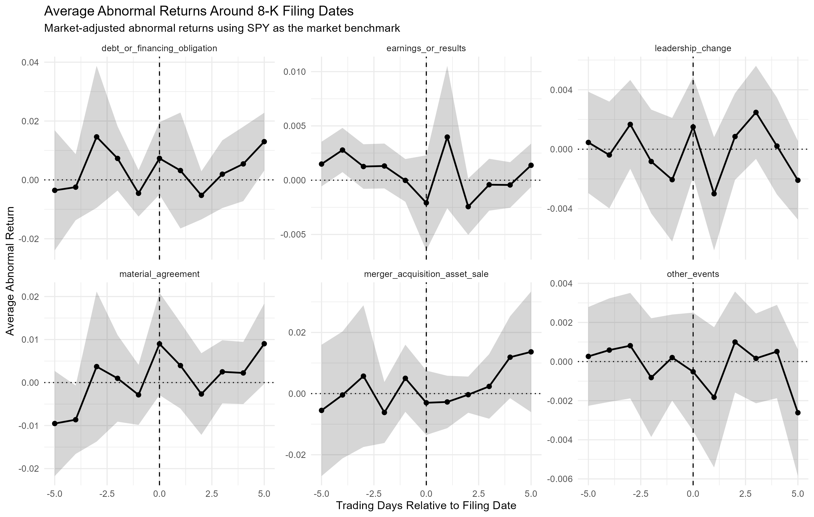

# SEC 8-K Filing Events and Short-Run Stock Reactions

This project studies whether publicly traded firms experience abnormal stock returns around major SEC 8-K filing events. The project combines SEC EDGAR filing data, daily stock return data, event-study methodology, and regression analysis in R.

The main research question is:

> Do firms experience abnormal returns after major 8-K filings, such as earnings releases, leadership changes, mergers, material agreements, or financing-related disclosures?

The project is designed as a finance/data-science learning project with an emphasis on reproducible data collection, large-data cleaning, event-study construction, and clear empirical interpretation.

---

## Project Overview

SEC Form 8-K filings are current reports that public companies file to disclose important corporate events. These events can include earnings releases, executive leadership changes, material agreements, acquisitions, financing obligations, and other major announcements.

This project builds an event-study pipeline that:

1. Downloads a sample of S&P 500 firms.
2. Retrieves SEC 8-K and 8-K/A filing metadata.
3. Parses 8-K item codes into event categories.
4. Downloads daily stock prices and computes returns.
5. Merges filing events to stock returns.
6. Constructs event windows around filing dates.
7. Estimates abnormal returns and cumulative abnormal returns.
8. Runs regressions comparing market reactions across filing types.
9. Generates plots and summary tables.

---

## Research Question

The central question is:

> Are different types of SEC 8-K filings associated with different short-run abnormal stock returns?

More specifically, the project estimates market reactions around 8-K item categories such as:

| 8-K Item  | Event Category                                     |
| --------- | -------------------------------------------------- |
| Item 1.01 | Entry into a Material Definitive Agreement         |
| Item 1.02 | Termination of a Material Definitive Agreement     |
| Item 2.01 | Completion of Acquisition or Disposition of Assets |
| Item 2.02 | Results of Operations and Financial Condition      |
| Item 2.03 | Creation of a Direct Financial Obligation          |
| Item 5.02 | Departure or Appointment of Directors or Officers  |
| Item 8.01 | Other Events                                       |
| Item 9.01 | Financial Statements and Exhibits                  |

Item 9.01 is retained in the parsed filing dataset but is generally excluded from the main event-study analysis because it often contains supporting exhibits rather than a standalone economic event.

---

## Methodology

### Event Study Design

The treatment event is the SEC 8-K filing date.

For each filing event, the project constructs an event window using trading days relative to the filing date:

```text
-5, -4, -3, -2, -1, 0, +1, +2, +3, +4, +5
```

where:

```text
event_time = 0
```

is the filing date or matched trading date.

The project uses trading days rather than calendar days so weekends and market holidays do not distort the event window.

---

## Abnormal Returns

The first version of the project uses market-adjusted abnormal returns:

```text
AR_i,t = R_i,t - R_m,t
```

where:

* `R_i,t` is the firm’s daily stock return.
* `R_m,t` is the market return.
* `AR_i,t` is the abnormal return.

SPY is used as the market benchmark.

For example, if a stock returns 2.0% on a given day and SPY returns 0.5%, the market-adjusted abnormal return is:

```text
2.0% - 0.5% = 1.5%
```

---

## Cumulative Abnormal Returns

The project then computes cumulative abnormal returns, or CARs:

```text
CAR_i,[a,b] = sum AR_i,t from event day a to event day b
```

The main CAR windows are:

| Variable    |   Window | Interpretation                                    |
| ----------- | -------: | ------------------------------------------------- |
| `CAR_m1_p1` | [-1, +1] | Day before filing through day after filing        |
| `CAR_0_p1`  |  [0, +1] | Filing day through next trading day               |
| `CAR_0_p5`  |  [0, +5] | Filing day through five trading days after filing |
| `CAR_m5_p5` | [-5, +5] | Wider pre/post event window                       |

These windows allow the project to examine immediate reactions, short-run post-filing reactions, and broader pre/post filing patterns.

---

## Regression Design

The main regression compares CARs across filing categories:

```text
CAR_i = alpha + beta_k ItemGroup_i + error_i
```

The project also estimates fixed-effect versions:

```text
CAR_i = beta_k ItemGroup_i + firm fixed effects + year fixed effects + error_i
```

The fixed-effect models control for:

* persistent differences across firms,
* broad year-level market conditions,
* repeated observations for the same firm.

Standard errors are clustered by ticker.

The reference category in the main regressions is:

```text
other_events
```

So each coefficient should be interpreted relative to other-event 8-K filings.

---

## Data Sources

This project uses:

* SEC EDGAR company submissions data for filing metadata.
* Current S&P 500 constituent data for the firm sample.
* Yahoo Finance price data through R’s `quantmod` package.
* SPY as the market benchmark.

The sample currently uses current S&P 500 constituents and examines their 8-K and 8-K/A filings from 2018 through 2025.

---

## Important Limitation

This project uses the current S&P 500 constituent list, not a historical S&P 500 membership panel.

That means the sample may contain survivorship bias because firms that were previously in the S&P 500 but later removed may not be included.

A stronger future version would use historical index membership by date.

---

## Repository Structure

```text
sec-8k-event-study/
│
├── README.md
│
├── data/
│   ├── raw/
│   ├── interim/
│   └── processed/
│
├── R/
│   ├── 01_get_companies.R
│   ├── 02_get_8k_filings.R
│   ├── 03_parse_8k_items.R
│   ├── 04_get_stock_returns.R
│   ├── 05_build_event_windows.R
│   ├── 06_estimate_abnormal_returns.R
│   ├── 07_regressions_and_plots.R
│   └── 08_sample_summary.R
│
├── output/
│   ├── tables/
│   └── figures/
│
└── writeup/
    └── event_study_report.qmd
```

---

## Script Descriptions

### `R/01_get_companies.R`

Downloads the current S&P 500 constituent list, cleans tickers and CIKs, and saves the company sample.

Output:

```text
data/interim/company_sample.csv
```

---

### `R/02_get_8k_filings.R`

Uses each company’s CIK to download SEC filing metadata, keeps 8-K and 8-K/A filings, and filters to the 2018–2025 sample period.

Output:

```text
data/interim/filings_8k.csv
```

---

### `R/03_parse_8k_items.R`

Parses the SEC `items` field into one row per filing-item pair and classifies item codes into readable event categories.

Output:

```text
data/interim/filing_items.csv
```

---

### `R/04_get_stock_returns.R`

Downloads daily adjusted stock prices from Yahoo Finance, computes daily returns, downloads SPY returns, and creates a trading-day index.

Output:

```text
data/interim/daily_returns.csv
```

---

### `R/05_build_event_windows.R`

Merges 8-K filing events to daily stock returns and constructs trading-day event windows around each filing.

Output:

```text
data/processed/event_returns.csv
```

---

### `R/06_estimate_abnormal_returns.R`

Computes market-adjusted abnormal returns and cumulative abnormal returns.

Outputs:

```text
data/processed/event_returns_with_ar.csv
data/processed/car_data.csv
output/tables/car_summary.csv
```

---

### `R/07_regressions_and_plots.R`

Creates event-time plots, runs CAR regressions, saves regression tables, and generates coefficient plots.

Outputs:

```text
output/figures/average_abnormal_returns_by_item_group.png
output/figures/car_coefficients_m1_p1.png
output/figures/car_coefficients_0_p1.png
output/figures/car_coefficients_0_p5.png
output/figures/sector_average_car_0_p1.png
output/tables/regression_results.txt
output/tables/sector_car_summary.csv
```

---

### `R/08_sample_summary.R`

Creates a sample-construction table showing how many observations survive each step of the pipeline.

Output:

```text
output/tables/sample_summary.csv
```

---

## How to Run the Project

Install the required R packages:

```r
install.packages(c(
  "data.table",
  "httr2",
  "jsonlite",
  "rvest",
  "stringr",
  "lubridate",
  "quantmod",
  "fixest",
  "broom",
  "ggplot2"
))
```

Then run the scripts in order:

```r
source("R/01_get_companies.R")
source("R/02_get_8k_filings.R")
source("R/03_parse_8k_items.R")
source("R/04_get_stock_returns.R")
source("R/05_build_event_windows.R")
source("R/06_estimate_abnormal_returns.R")
source("R/07_regressions_and_plots.R")
source("R/08_sample_summary.R")
```

For the expanded S&P 500 sample, it is better to run each script one at a time. Some scripts make many web requests and may take several minutes.

---

## Expected Outputs

After running the full pipeline, the project should generate these key datasets:

```text
data/interim/company_sample.csv
data/interim/filings_8k.csv
data/interim/filing_items.csv
data/interim/daily_returns.csv
data/processed/event_returns.csv
data/processed/event_returns_with_ar.csv
data/processed/car_data.csv
```

And these key tables:

```text
output/tables/car_summary.csv
output/tables/regression_results.txt
output/tables/sector_car_summary.csv
output/tables/sample_summary.csv
```

And these key figures:

```text
output/figures/average_abnormal_returns_by_item_group.png
output/figures/car_coefficients_m1_p1.png
output/figures/car_coefficients_0_p1.png
output/figures/car_coefficients_0_p5.png
output/figures/sector_average_car_0_p1.png
```

---

## Example Output: Average Abnormal Returns

The event-time plot shows average abnormal returns from five trading days before to five trading days after the filing date.

Expected figure path:

```text
output/figures/average_abnormal_returns_by_item_group.png
```

Markdown preview:

```markdown

```

---

## Example Output: Regression Coefficient Plots

The coefficient plots show how each filing type compares to the reference category, `other_events`.

Expected figure paths:

```text
output/figures/car_coefficients_m1_p1.png
output/figures/car_coefficients_0_p1.png
output/figures/car_coefficients_0_p5.png
```

Markdown previews:

```markdown
![CAR[-1,+1] regression coefficients](output/figures/car_coefficients_m1_p1.png)

![CAR[0,+1] regression coefficients](output/figures/car_coefficients_0_p1.png)

![CAR[0,+5] regression coefficients](output/figures/car_coefficients_0_p5.png)
```

---

## Interpreting the Results

A positive CAR means the firm outperformed the market benchmark over the event window.

A negative CAR means the firm underperformed the market benchmark over the event window.

For example, if an earnings-related 8-K has:

```text
CAR_0_p1 = 0.012
```

then the stock outperformed SPY by approximately 1.2 percentage points from the filing day through the next trading day.

Regression coefficients are interpreted relative to the reference group, `other_events`.

For example, if the coefficient on `earnings_or_results` is:

```text
0.008
```

then earnings-related 8-K filings are associated with CARs about 0.8 percentage points higher than other-event filings, conditional on the controls included in the model.

If the confidence interval crosses zero, the estimate is statistically imprecise.

---

## What This Project Demonstrates

This project demonstrates:

* SEC EDGAR data collection.
* API-based data retrieval.
* Financial identifier cleaning using tickers and CIKs.
* Large-data manipulation in R with `data.table`.
* Parsing 8-K item codes.
* Merging event data to daily stock returns.
* Event-study design.
* Abnormal return and CAR construction.
* Regression modeling with fixed effects using `fixest`.
* Clustered standard errors.
* Data visualization with `ggplot2`.
* Reproducible empirical finance workflow.

---

## Current Limitations

This is a learning project, and several limitations remain:

1. The sample uses current S&P 500 constituents rather than historical index membership.
2. Yahoo Finance data is convenient but less academically rigorous than CRSP.
3. The filing date may not be the first public announcement date.
4. After-hours filings may be reflected in the next trading day rather than the filing day.
5. Multiple important events can occur close together, making attribution difficult.
6. Some 8-K filings contain multiple item codes.
7. The current abnormal return model is market-adjusted rather than a full market-model event study.

---

## Future Improvements

Planned or possible upgrades include:

* Use CRSP instead of Yahoo Finance for cleaner return data.
* Add a market-model abnormal return method using an estimation window such as [-120, -20].
* Use historical S&P 500 membership instead of current constituents.
* Adjust event dates using SEC acceptance timestamps and market close times.
* Drop or flag overlapping events within a short window.
* Compare 8-K filings by sector.
* Add robustness checks for alternative event windows.
* Build a Quarto research report.
* Add automated tests for the data-cleaning functions.
* Add a pipeline manager such as `targets`.

---

## Suggested Resume Description

Built an R event-study pipeline analyzing short-run abnormal stock returns around SEC 8-K filings. Parsed SEC EDGAR filing metadata, extracted filing dates, CIKs, tickers, form types, and 8-K item codes, merged disclosure events to daily equity returns, estimated cumulative abnormal returns by event category, and ran fixed-effect regressions using `data.table`, `httr2`, `jsonlite`, `quantmod`, `fixest`, and `ggplot2`.

---

## Disclaimer

This project is for educational and research purposes only. It is not investment advice. The results should not be used to make trading decisions without further validation, stronger data sources, and a more rigorous empirical design.
=======
# SEC 8-K Filing Events and Short-Run Stock Reactions

This project studies whether publicly traded firms experience abnormal stock returns around major SEC 8-K filing events. The project combines SEC EDGAR filing data, daily stock return data, event-study methodology, and regression analysis in R.

The main research question is:

> Do firms experience abnormal returns after major 8-K filings, such as earnings releases, leadership changes, mergers, material agreements, or financing-related disclosures?

The project is designed as a finance/data-science learning project with an emphasis on reproducible data collection, large-data cleaning, event-study construction, and clear empirical interpretation.

---

## Project Overview

SEC Form 8-K filings are current reports that public companies file to disclose important corporate events. These events can include earnings releases, executive leadership changes, material agreements, acquisitions, financing obligations, and other major announcements.

This project builds an event-study pipeline that:

1. Downloads a sample of S&P 500 firms.
2. Retrieves SEC 8-K and 8-K/A filing metadata.
3. Parses 8-K item codes into event categories.
4. Downloads daily stock prices and computes returns.
5. Merges filing events to stock returns.
6. Constructs event windows around filing dates.
7. Estimates abnormal returns and cumulative abnormal returns.
8. Runs regressions comparing market reactions across filing types.
9. Generates plots and summary tables.

---

## Research Question

The central question is:

> Are different types of SEC 8-K filings associated with different short-run abnormal stock returns?

More specifically, the project estimates market reactions around 8-K item categories such as:

| 8-K Item  | Event Category                                     |
| --------- | -------------------------------------------------- |
| Item 1.01 | Entry into a Material Definitive Agreement         |
| Item 1.02 | Termination of a Material Definitive Agreement     |
| Item 2.01 | Completion of Acquisition or Disposition of Assets |
| Item 2.02 | Results of Operations and Financial Condition      |
| Item 2.03 | Creation of a Direct Financial Obligation          |
| Item 5.02 | Departure or Appointment of Directors or Officers  |
| Item 8.01 | Other Events                                       |
| Item 9.01 | Financial Statements and Exhibits                  |

Item 9.01 is retained in the parsed filing dataset but is generally excluded from the main event-study analysis because it often contains supporting exhibits rather than a standalone economic event.

---

## Methodology

### Event Study Design

The treatment event is the SEC 8-K filing date.

For each filing event, the project constructs an event window using trading days relative to the filing date:

```text
-5, -4, -3, -2, -1, 0, +1, +2, +3, +4, +5
```

where:

```text
event_time = 0
```

is the filing date or matched trading date.

The project uses trading days rather than calendar days so weekends and market holidays do not distort the event window.

---

## Abnormal Returns

The first version of the project uses market-adjusted abnormal returns:

```text
AR_i,t = R_i,t - R_m,t
```

where:

* `R_i,t` is the firm’s daily stock return.
* `R_m,t` is the market return.
* `AR_i,t` is the abnormal return.

SPY is used as the market benchmark.

For example, if a stock returns 2.0% on a given day and SPY returns 0.5%, the market-adjusted abnormal return is:

```text
2.0% - 0.5% = 1.5%
```

---

## Cumulative Abnormal Returns

The project then computes cumulative abnormal returns, or CARs:

```text
CAR_i,[a,b] = sum AR_i,t from event day a to event day b
```

The main CAR windows are:

| Variable    |   Window | Interpretation                                    |
| ----------- | -------: | ------------------------------------------------- |
| `CAR_m1_p1` | [-1, +1] | Day before filing through day after filing        |
| `CAR_0_p1`  |  [0, +1] | Filing day through next trading day               |
| `CAR_0_p5`  |  [0, +5] | Filing day through five trading days after filing |
| `CAR_m5_p5` | [-5, +5] | Wider pre/post event window                       |

These windows allow the project to examine immediate reactions, short-run post-filing reactions, and broader pre/post filing patterns.

---

## Regression Design

The main regression compares CARs across filing categories:

```text
CAR_i = alpha + beta_k ItemGroup_i + error_i
```

The project also estimates fixed-effect versions:

```text
CAR_i = beta_k ItemGroup_i + firm fixed effects + year fixed effects + error_i
```

The fixed-effect models control for:

* persistent differences across firms,
* broad year-level market conditions,
* repeated observations for the same firm.

Standard errors are clustered by ticker.

The reference category in the main regressions is:

```text
other_events
```

So each coefficient should be interpreted relative to other-event 8-K filings.

---

## Data Sources

This project uses:

* SEC EDGAR company submissions data for filing metadata.
* Current S&P 500 constituent data for the firm sample.
* Yahoo Finance price data through R’s `quantmod` package.
* SPY as the market benchmark.

The sample currently uses current S&P 500 constituents and examines their 8-K and 8-K/A filings from 2018 through 2025.

---

## Important Limitation

This project uses the current S&P 500 constituent list, not a historical S&P 500 membership panel.

That means the sample may contain survivorship bias because firms that were previously in the S&P 500 but later removed may not be included.

A stronger future version would use historical index membership by date.

---

## Repository Structure

```text
sec-8k-event-study/
│
├── README.md
│
├── data/
│   ├── raw/
│   ├── interim/
│   └── processed/
│
├── R/
│   ├── 01_get_companies.R
│   ├── 02_get_8k_filings.R
│   ├── 03_parse_8k_items.R
│   ├── 04_get_stock_returns.R
│   ├── 05_build_event_windows.R
│   ├── 06_estimate_abnormal_returns.R
│   ├── 07_regressions_and_plots.R
│   └── 08_sample_summary.R
│
├── output/
│   ├── tables/
│   └── figures/
│
└── writeup/
    └── event_study_report.qmd
```

---

## Script Descriptions

### `R/01_get_companies.R`

Downloads the current S&P 500 constituent list, cleans tickers and CIKs, and saves the company sample.

Output:

```text
data/interim/company_sample.csv
```

---

### `R/02_get_8k_filings.R`

Uses each company’s CIK to download SEC filing metadata, keeps 8-K and 8-K/A filings, and filters to the 2018–2025 sample period.

Output:

```text
data/interim/filings_8k.csv
```

---

### `R/03_parse_8k_items.R`

Parses the SEC `items` field into one row per filing-item pair and classifies item codes into readable event categories.

Output:

```text
data/interim/filing_items.csv
```

---

### `R/04_get_stock_returns.R`

Downloads daily adjusted stock prices from Yahoo Finance, computes daily returns, downloads SPY returns, and creates a trading-day index.

Output:

```text
data/interim/daily_returns.csv
```

---

### `R/05_build_event_windows.R`

Merges 8-K filing events to daily stock returns and constructs trading-day event windows around each filing.

Output:

```text
data/processed/event_returns.csv
```

---

### `R/06_estimate_abnormal_returns.R`

Computes market-adjusted abnormal returns and cumulative abnormal returns.

Outputs:

```text
data/processed/event_returns_with_ar.csv
data/processed/car_data.csv
output/tables/car_summary.csv
```

---

### `R/07_regressions_and_plots.R`

Creates event-time plots, runs CAR regressions, saves regression tables, and generates coefficient plots.

Outputs:

```text
output/figures/average_abnormal_returns_by_item_group.png
output/figures/car_coefficients_m1_p1.png
output/figures/car_coefficients_0_p1.png
output/figures/car_coefficients_0_p5.png
output/figures/sector_average_car_0_p1.png
output/tables/regression_results.txt
output/tables/sector_car_summary.csv
```

---

### `R/08_sample_summary.R`

Creates a sample-construction table showing how many observations survive each step of the pipeline.

Output:

```text
output/tables/sample_summary.csv
```

---

## How to Run the Project

Install the required R packages:

```r
install.packages(c(
  "data.table",
  "httr2",
  "jsonlite",
  "rvest",
  "stringr",
  "lubridate",
  "quantmod",
  "fixest",
  "broom",
  "ggplot2"
))
```

Then run the scripts in order:

```r
source("R/01_get_companies.R")
source("R/02_get_8k_filings.R")
source("R/03_parse_8k_items.R")
source("R/04_get_stock_returns.R")
source("R/05_build_event_windows.R")
source("R/06_estimate_abnormal_returns.R")
source("R/07_regressions_and_plots.R")
source("R/08_sample_summary.R")
```

For the expanded S&P 500 sample, it is better to run each script one at a time. Some scripts make many web requests and may take several minutes.

---

## Expected Outputs

After running the full pipeline, the project should generate these key datasets:

```text
data/interim/company_sample.csv
data/interim/filings_8k.csv
data/interim/filing_items.csv
data/interim/daily_returns.csv
data/processed/event_returns.csv
data/processed/event_returns_with_ar.csv
data/processed/car_data.csv
```

And these key tables:

```text
output/tables/car_summary.csv
output/tables/regression_results.txt
output/tables/sector_car_summary.csv
output/tables/sample_summary.csv
```

And these key figures:

```text
output/figures/average_abnormal_returns_by_item_group.png
output/figures/car_coefficients_m1_p1.png
output/figures/car_coefficients_0_p1.png
output/figures/car_coefficients_0_p5.png
output/figures/sector_average_car_0_p1.png
```

---

## Example Output: Average Abnormal Returns

The event-time plot shows average abnormal returns from five trading days before to five trading days after the filing date.

Expected figure path:

```text
output/figures/average_abnormal_returns_by_item_group.png
```

Markdown preview:

```markdown

```

---

## Example Output: Regression Coefficient Plots

The coefficient plots show how each filing type compares to the reference category, `other_events`.

Expected figure paths:

```text
output/figures/car_coefficients_m1_p1.png
output/figures/car_coefficients_0_p1.png
output/figures/car_coefficients_0_p5.png
```

Markdown previews:

```markdown
![CAR[-1,+1] regression coefficients](output/figures/car_coefficients_m1_p1.png)

![CAR[0,+1] regression coefficients](output/figures/car_coefficients_0_p1.png)

![CAR[0,+5] regression coefficients](output/figures/car_coefficients_0_p5.png)
```

---

## Interpreting the Results

A positive CAR means the firm outperformed the market benchmark over the event window.

A negative CAR means the firm underperformed the market benchmark over the event window.

For example, if an earnings-related 8-K has:

```text
CAR_0_p1 = 0.012
```

then the stock outperformed SPY by approximately 1.2 percentage points from the filing day through the next trading day.

Regression coefficients are interpreted relative to the reference group, `other_events`.

For example, if the coefficient on `earnings_or_results` is:

```text
0.008
```

then earnings-related 8-K filings are associated with CARs about 0.8 percentage points higher than other-event filings, conditional on the controls included in the model.

If the confidence interval crosses zero, the estimate is statistically imprecise.

---

## What This Project Demonstrates

This project demonstrates:

* SEC EDGAR data collection.
* API-based data retrieval.
* Financial identifier cleaning using tickers and CIKs.
* Large-data manipulation in R with `data.table`.
* Parsing 8-K item codes.
* Merging event data to daily stock returns.
* Event-study design.
* Abnormal return and CAR construction.
* Regression modeling with fixed effects using `fixest`.
* Clustered standard errors.
* Data visualization with `ggplot2`.
* Reproducible empirical finance workflow.

---

## Current Limitations

This is a learning project, and several limitations remain:

1. The sample uses current S&P 500 constituents rather than historical index membership.
2. Yahoo Finance data is convenient but less academically rigorous than CRSP.
3. The filing date may not be the first public announcement date.
4. After-hours filings may be reflected in the next trading day rather than the filing day.
5. Multiple important events can occur close together, making attribution difficult.
6. Some 8-K filings contain multiple item codes.
7. The current abnormal return model is market-adjusted rather than a full market-model event study.

---

## Future Improvements

Planned or possible upgrades include:

* Use CRSP instead of Yahoo Finance for cleaner return data.
* Add a market-model abnormal return method using an estimation window such as [-120, -20].
* Use historical S&P 500 membership instead of current constituents.
* Adjust event dates using SEC acceptance timestamps and market close times.
* Drop or flag overlapping events within a short window.
* Compare 8-K filings by sector.
* Add robustness checks for alternative event windows.
* Build a Quarto research report.
* Add automated tests for the data-cleaning functions.
* Add a pipeline manager such as `targets`.

---

## Suggested Resume Description

Built an R event-study pipeline analyzing short-run abnormal stock returns around SEC 8-K filings. Parsed SEC EDGAR filing metadata, extracted filing dates, CIKs, tickers, form types, and 8-K item codes, merged disclosure events to daily equity returns, estimated cumulative abnormal returns by event category, and ran fixed-effect regressions using `data.table`, `httr2`, `jsonlite`, `quantmod`, `fixest`, and `ggplot2`.

---

## Disclaimer

This project is for educational and research purposes only. It is not investment advice. The results should not be used to make trading decisions without further validation, stronger data sources, and a more rigorous empirical design.
>>>>>>> 98a59c7960cff6d631f172135ac0393aa134dd85
